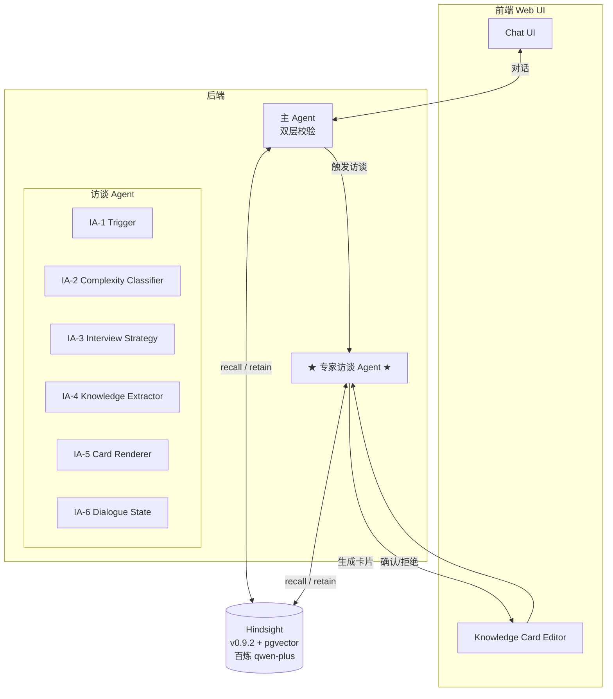

# Hindsight Chatbot — Knowledge Extraction Agent Roadmap

> **创建日期**：2026-08-28
> **最后更新**：2026-08-29（状态对齐：Phase 0/1/2 已完成，Phase 3 待启动）
> **状态**：Phase 0/1/2 ✅ 已完成｜Phase 3 ⏳ 待启动
> **协作方式**：本文件是项目 source of truth，所有架构 / 模块 / 阶段变更必须先更新本文

---

## 1. 项目概述

### 1.1 定位

独立的 Chatbot 产品，核心能力是**长期记忆 + 主动学习**：

- 用户提问时，Agent 同时用 **LLM 自身知识 + Hindsight 召回**回答（双层校验）
- 当两者都答不上时，自动开启**专家访谈模式**，向用户追问
- 访谈产出的隐性知识被萃取为结构化事实 → 用户审核 → 存入 Hindsight
- 未来类似问题能被 recall 命中，访谈频率随知识库增长而降低

### 1.2 与 vectorize-io/hindsight 的关系

**本项目是 Hindsight 之上的应用层**，不重新发明记忆系统：

- Hindsight（v0.9.2）已部署：pgvector + 百炼 qwen-plus + 本地 BGE/MiniLM
- 我们构建**"提问 / 访谈 / 萃取 / 审核"**的编排层
- Hindsight 提供 retain / recall / reflect / MCP，我们负责 Agent 逻辑、UI、访谈策略

### 1.3 目标用户场景（v1）

| 场景 | 描述 |
|---|---|
| 个人知识管理 | 用户希望 Chatbot 越来越了解他的偏好、项目、决策原因 |
| 团队知识沉淀 | 团队成员轮流被 Chatbot 访谈，沉淀团队共识 |
| 冷启动 | Hindsight 库空时频繁触发访谈；知识库积累后访谈频率自然下降 |

---

## 2. 系统架构



---

## 3. 已确定的关键决策

> 本节防重复讨论——任何想推翻这些决策的讨论必须先更新本文档。

| 维度 | 决策 | 备注 |
|---|---|---|
| Agent 形态 | 独立 Chatbot 产品 | 不嵌到别的产品里，有自己的 UI |
| 知识判定 | **双层校验**：LLM 答 + Hindsight 增补 | 不严格区分"知道/不知道"，Hindsight 始终做 hint |
| 访谈触发条件 | Hindsight recall 空 + LLM 也不确定 | "不确定"的具体定义见 Q1 |
| 访谈深度 | **自适应**：简单事实单轮 / 抽象知识多轮（3-5 轮） | 由 Complexity Classifier 决定 |
| 萃取 + retain | 访谈 Agent 生成**知识卡** → **用户审核** → retain | 用户必须显式确认才落库 |
| **技术架构**（演进式）| 全程使用 **Vercel AI SDK** + **纯函数 state machine**；**不引入 workflow 框架引擎**（Phase 3 调研后决策） | Mastra / Vercel Workflow / Inngest 等框架引擎暂缓——当前规模自管 ~200 LOC 已覆盖需求；升级触发条件见 §7。**不使用 Mastra Memory**（Hindsight 已是记忆后端，避免重复） |
| **访谈 Agent model**（Phase 3 约束） | **复用主 Agent 的 qwen-plus**（Q2 已决策） | 统一 LLM 客户端简化 DI；Phase 6 评估若发现多轮 LLM 成本不可接受再升级到便宜模型 |
| **多次访谈矛盾处理**（Phase 3 约束） | **显式提示用户矛盾 + 让他解释**（Q4 已决策） | 访谈 Agent 触发多轮时，若 recall 命中与新问题主题相关但内容矛盾，把矛盾 facts 列给用户，让用户判定「口误 / 认真」；判定后：(a) 口误 → 继续访谈、不替换；(b) 认真 → retain 新知识时用 Hindsight API context 机制替换老 facts |

---

## 4. 核心模块清单

### 4.1 主 Agent 层

| 编号 | 模块 | 职责 |
|---|---|---|
| MA-1 | 主 Agent | 对话入口，LLM 直答 |
| MA-2 | Async Recall | 异步从 Hindsight 拉相关 facts 注入上下文做增补 |
| MA-3 | Routing | 判断是否需要触发访谈 |

### 4.2 专家访谈 Agent 层（核心创新点）

| 编号 | 模块 | 职责 |
|---|---|---|
| IA-1 | Trigger & Routing | 进 / 出访谈模式的判定 |
| IA-2 | Complexity Classifier | 判断问题复杂度（单轮 / 多轮） |
| IA-3 | Interview Strategy | 多轮追问的计划生成（怎么决定下一轮问什么） |
| IA-4 | Knowledge Extractor | Q/A → 结构化事实 |
| IA-5 | Knowledge Card Renderer | 可审核卡片生成 |
| IA-6 | Dialogue State | 多轮对话的 session 管理 |

### 4.3 用户交互层

| 编号 | 模块 | 职责 |
|---|---|---|
| UI-1 | Chat UI | 主对话界面 |
| UI-2 | Knowledge Card Editor | 知识卡编辑 / 审核界面 |
| UI-3 | Bank/Tags Browser | 浏览 Hindsight 里的知识库 |

### 4.4 基础设施

| 编号 | 模块 | 职责 |
|---|---|---|
| INF-1 | Hindsight Client | Hindsight API 的 SDK 封装 |
| INF-2 | LLM Client | 统一 LLM 客户端（百炼 OpenAI 兼容模式） |
| INF-3 | Session Storage | 对话 session 持久化 |
| INF-4 | Audit Log | 用户答过什么 / 存了什么 / 召回时用了什么 |

---

## 5. 开发阶段

### Phase 0：基础设施 & 最小骨架

**目标**：Hindsight 跑起来，最简 Chatbot UI 能对话（不接 Hindsight 逻辑）

涉及模块：

- INF-1 Hindsight Client（封装 retain / recall / reflect）
- INF-2 LLM Client（百炼 qwen-plus）
- UI-1 Chat UI（最简版）

Done 标准：

- [x] Hindsight 在 `localhost:8888` 健康运行（`./docker-compose.yml`）
- [x] Next.js + TypeScript 后端能调 Hindsight API（`chatbot/lib/hindsight.ts`）
- [x] Web UI 能发消息，LLM 直接回答（Phase 1 已扩展为带 recall 的双层校验）

---

### Phase 1：双层校验主 Agent

**目标**：主 Agent 实现"LLM 答 + Hindsight 增补"

涉及模块：

- MA-1 主 Agent（**技术栈：Vercel AI SDK** — `streamText` + `tool` + `useChat`）
- MA-2 Async Recall

增补设计（Q1 已确定）：

- **方式**：LLM prompt 注入 recall 结果（自然融合）+ UI 折叠区显式展示"参考记忆"
- **recall 配置**：`types=["observation","world"]` + `prefer_observations=true`（避免 observation 与 raw fact 重复）+ `budget="mid"` + `max_tokens=2048` + `include.entities=true` + `min_scores.reranker=0.3`（过滤低相关 noise）
- **同步执行**：recall 与 LLM 答同步进行，不异步；用户期望"问一次答一次"
- **UI 展示**：主答案下方折叠区，默认收起，列出 recall 返回的具体 facts + entities + scores；标注"🤖 基于你的长期记忆回答"
- **Hindsight 部署态**：`HINDSIGHT_API_RERANKER_PROVIDER=alibaba` + `qwen3-rerank`（默认 `local` ms-marco-MiniLM 对中文 broken）

Done 标准：

- [x] 用户发问 → recall(Q) 同步 → LLM 用注入的 recall 结果答 → 主答案下方展示"参考记忆"折叠区
- [x] recall 空时双层校验依然工作（仅 LLM 答，无增补，无折叠区）— 由 `min_scores.reranker=0.3` 保证
- [x] recall 命中时折叠区显示具体 facts + entities + scores
- [x] observation 与 raw fact 不重复（prefer_observations=true 生效）
- [x] 中文 / 英文 recall 都验证过
- [x] 同一问题连续问 5 次，recall 召回稳定（无大幅波动）

---

### Phase 2：访谈 Agent — 单轮基础版

**目标**：recall 空 + LLM 不确定 → 触发单轮访谈 → retain

涉及模块：

- IA-1 Trigger & Routing
- IA-2 Complexity Classifier（v1：仅判断"是否进访谈"，不区分单/多轮）
- IA-6 Dialogue State（v1：单轮，不需要 state）

Done 标准：

- [x] recall 空时主 Agent 自动进入访谈模式（`chatbot/lib/chat/mode-router.ts`）
- [x] Agent 反问用户一次（`chatbot/lib/chat/interview/composer.ts`）
- [x] 用户回答后直接 retain（v1 不走用户审核，走 `/api/interview`）
- [x] 下次问同一问题，recall 能命中（已用 zhangwei bank 验证）

---

### Phase 3：访谈 Agent — 多轮策略

**目标**：复杂问题触发多轮追问（3-5 轮）

涉及模块：

- IA-2 Complexity Classifier（升级：判断复杂度）
- IA-3 Interview Strategy（**核心**：怎么追问）
- IA-6 Dialogue State（升级：多轮 session）

持久化方案（2026-08-29 调研后决策）：

- **复用 Hindsight 同 Postgres 实例**，新建独立 schema `chatbot_interview`（不污染 Hindsight 表）
- session 表设计：`session_id` / `bank_id` / `turns` JSONB / `round` / `complexity` / `state` / `created_at` / `updated_at`
- 状态机走**纯函数 + DI seam**：`nextTurn(state, userAnswer) → { newState, nextQuestion } | finished`
- **不引入 Mastra / Vercel Workflow / Inngest 等框架引擎**——~200 LOC 自管已够用；框架升级触发条件见 §7

追问框架（2026-08-29 借鉴 matrix 萃取流程 §2）：

- **事件类型模板**（按问题分类选 1 类追问）：
  - 成功案例：场景 → 关键转折 → 为什么那么做 → 重来怎么做
  - 失败案例：最早哪里出问题 → 为什么没发现 → 后来怎么看 → 反常信号
  - 判断失误：原本怎么判断 → 实际发生什么 → 偏差出在哪个环节 → 下次怎么调
  - 反直觉案例：别人怎么看 → 你为什么坚持 → 关键变量 → 能复制吗
- **单决策五要素挖法**（每轮挖）：触发事件 → 观察信号 → 判断标准 → 行动方案 → 结果验证（含反例）
- **边界挖掘（反例探针）**：用户说"如果 A 就 B"后追问"有没有 A 但不是 B 的情况 / 有没有不是 A 但也是 B 的情况 / 边界在哪"
- 复杂度判定为"抽象判断/决策类"才进多轮；纯事实类保持单轮

Q4 替换流程（2026-08-29 API 实测验证）：

- 触发条件：recall 命中与新问题主题相关但内容矛盾的 facts
- 用户判定后：
  - **口误** → 继续访谈、不替换，新事实 retain 时打 `context="correction_of_session_<id>"` 留审计痕迹
  - **认真** → 走替换：
    1. `PATCH /v1/default/banks/{bank}/memories/{old_id}` body `{"state": "invalidated"}`
    2. `POST /v1/default/banks/{bank}/memories` retain 新事实
- 注意：**Hindsight 不做自然 dedup**，同样内容两次 retain 会创建 2 个独立 facts——Q4 替换必须主动 PATCH + POST，不能依赖 API 自动行为

Done 标准：

- [ ] 抽象问题（"为什么这样设计"）能追问 3-5 轮
- [ ] 追问覆盖：事件类型模板 + 五要素挖法 + 边界挖掘（按 matrix §2 方法）
- [ ] 简单事实依然单轮
- [ ] 多轮访谈产出的知识卡质量明显好于单轮（人工评测）
- [ ] session 在 Postgres 持久化，刷新 / 关 tab / 换设备能续上
- [ ] 多用户隔离（`bank_id` 维度的 session 隔离）
- [ ] Q4 替换：用户判定"认真"后能 PATCH 老 fact + retain 新 fact；recall 验证老 fact 已被排除
- [ ] Classifier 接口化（Strategy pattern），默认启发式实现可单测，LLM fallback 接口留好
- [ ] 专家主动控制：访谈中任何轮次专家可点「够了」结束（走 retain）或「放弃」取消（不 retain）

Classifier 接口设计（2026-08-29 决策）：

```typescript
// 策略接口（DI seam）
interface ComplexityClassifier {
  classify(input: { query: string; recall: RecallResult[] }): Promise<Classification>;
}

interface Classification {
  complexity: 'simple' | 'decision' | 'abstract';  // D1: 决定轮数 1 / 3 / 5
  event_type?: 'success' | 'failure' | 'misjudgment' | 'counterintuitive' | 'fact';  // D2: 决定追问模板
  needs_conflict_check: boolean;  // D3: 是否触发 Q4 矛盾提示
  reasoning?: string;  // 调试 / UI 展示用
  confidence: number;  // 0-1，< 0.6 时建议 fallback 到 LLM
}
```

实现路径（按演进顺序）：

1. **`RuleBasedClassifier`**（默认）— 关键词 + 正则 + 启发式，10-20 条规则就够，**规则要少而精**
2. **`HybridClassifier`**（fallback）— 先 `RuleBasedClassifier`，`confidence < 0.6` 才发 LLM 调用（用 qwen-plus）
3. **`LLMClassifier`**（纯 LLM）— Phase 6 评估后看是否值得
4. **专用分类模型**（未来）— 如果 Classifier 调用量大且 LLM fallback 成本高，可微调小模型替换

防"作死"原则：

- 启发式规则**宁少勿多**，每条都要单测
- 灰区问题**默认走更深的追问**（prefer 多轮），与"宁多问不漏挖"哲学一致
- LLM fallback 触发要**可观测**（记日志），方便 Phase 6 调优
- 接口化后**任何实现都可 A/B 替换**，不影响上游

---

### Phase 4：知识萃取自动化

**目标**：访谈 Agent 自动把 Q/A 整理成结构化知识卡

涉及模块：

- IA-4 Knowledge Extractor
- IA-6 Dialogue State（升级：保存访谈历史）

Done 标准：

- [ ] 多轮对话被整理成知识卡，包含实体 / 关系 / 时间 / 上下文 / 边界
- [ ] 知识卡能 retain 到 Hindsight（retain 前先 `POST /memories/dry-run-extract` 预览）
- [ ] retain 后 Hindsight 的 observation 自动 consolidate 工作正常

---

### Phase 5：用户审核 + retain 闭环

**目标**：知识卡给用户审核、编辑后再 retain

涉及模块：

- IA-5 Knowledge Card Renderer
- UI-2 Knowledge Card Editor

Done 标准：

- [ ] 访谈结束后，UI 弹出知识卡
- [ ] 用户能编辑 / 补充 / 删除
- [ ] 用户点确认才触发 retain
- [ ] 拒绝 / 跳过 / 专家主动放弃时访谈结果丢弃（Phase 3 引入的「够了」/「放弃」按钮贯穿 Phase 4-5）

---

### Phase 6：质量打磨 & 评估

**目标**：召回率 / 萃取质量 / 审核通过率达标

涉及模块：

- INF-4 Audit Log
- 评估脚本（独立工具）

Done 标准：

- [ ] 建立 recall 测试集（人工标注问题 + 期望命中）
- [ ] recall 命中率 ≥ 80%
- [ ] 知识卡审核通过率 ≥ 70%（用户不需要大幅修改）
- [ ] 访谈触发频率合理（不会过于频繁）
- [ ] LLM 调用成本可控

---

### Phase 7：生产化

**目标**：监控、备份、权限、限流

涉及模块：

- 监控（基于 Hindsight 自带的 `/metrics` + Prometheus）
- 备份（Hindsight PG 数据）
- 鉴权（API key / OAuth）
- 限流（用户 / IP）
- 部署文档

Done 标准：

- [ ] 关键指标（LLM 调用、token 消耗、recall 命中率）可观测
- [ ] PG 每日自动备份
- [ ] API 鉴权开启
- [ ] 有 README 让别人能 5 分钟复现部署

---

## 6. 待讨论项（Open Questions）

> 启动对应 Phase 前必须先解决对应 Open Question。

| # | 问题 | 触发时机 | 状态 |
|---|---|---|---|
| Q1 | "Hindsight 增补"的具体语义：注入 prompt / 单独展示 / 二者结合？ | Phase 1 设计前 | ✅ 已解决 |
| Q2 | 访谈 Agent 用什么 model？复用主 Agent 还是另起？ | Phase 2 设计前 | ✅ 已解决 — **复用 qwen-plus**（与主 Agent 同 model，成本可控；如 Phase 6 评估发现成本过高可重启） |
| Q3 | 知识卡 schema：自定义 / 复用现有标准（Dublin Core 等）？ | Phase 4 设计前 | ✅ 已解决 — **借鉴 matrix 萃取流程 §6.6 schema 做轻量化适配**：`id` / `title` / `statement` / `confidence` / `key_signals` / `exceptions` / `source`（访谈 ID 溯源）；不引入 Dublin Core 等外部标准 |
| Q4 | 用户多次访谈同一主题，前后矛盾怎么办？ | Phase 3 实施时 | ✅ 已解决 — **把矛盾内容展示给正在接受访谈的用户，让他解释是口误还是认真表态**；如果是认真的，新访谈 retain 时**替换**老信息（Hindsight retain API 支持 context 覆盖/去重；具体调用见 Hindsight API 文档） |
| Q5 | 是否要做"主动学习"（Agent 发现知识缺口主动访谈）？ | Phase 6 后 | 待讨论 |
| Q6 | 多人共用 Hindsight 还是单人？多 bank 怎么组织？ | Phase 7 设计前 | 待讨论 |
| Q7 | Hindsight 的 `disposition traits`（怀疑 / 字面 / 共情）要不要用？ | Phase 1 设计前 | ⛔ 已关闭 — Phase 1 未引入，按默认行为运行；如未来需要可在 Phase 6 重启 |

---

## 7. 风险与备选方案

| 风险 | 触发场景 | 备选方案 |
|---|---|---|
| LLM 抽取不稳定，结构化字段缺失 | Phase 4 测试时 | few-shot + self-consistency（多次抽取取众数） |
| 用户审核疲劳 | Phase 5 上线后 | 提供"快速批准"按钮 + 默认信任级别（用户可调） |
| Hindsight 召回率不达标 | Phase 6 评估时 | 调整 `HINDSIGHT_API_SEMANTIC_MIN_SIMILARITY` 等参数 / 换 embedding 模型 |
| 访谈 LLM 调用成本高 | Phase 3 多轮后 | 用更便宜的模型做追问，复杂问题再升级 |
| 多用户冲突 | Phase 7 | 用 bank 隔离 + audit log |
| 自管 state machine 不够用 | Phase 5/6 上量后 | **升级到 Vercel Workflow**（综合分 41/45，本项目已锁 Next.js 16 + AI SDK 7，零迁移成本）——**不是 Mastra**（Mastra 在对比中未进 Top 3）；备选 Inngest（38/45，适合需要事件驱动架构时） |
| 访谈策略退化为复读机 | Phase 3 | 引入"未来召回率"作为评测指标 |

---

## 8. 参考资源

- [vectorize-io/hindsight](https://github.com/vectorize-io/hindsight) — Hindsight 仓库
- [Hindsight 文档](https://hindsight.vectorize.io) — 官方文档
- [Hindsight 论文](https://arxiv.org/abs/2512.12818) — arXiv
- 本项目核心文件：
  - `./docker-compose.yml` — Hindsight 部署
  - `./ROADMAP.md` — 本文档
- **跨项目参考**：[matrix 知识萃取流程设计](../../../matrix/neo/design/docs/product/knlg-base/extraction-flow.md) — Phase 3 IA-3 / Phase 4 IA-4 / Phase 5 知识卡 / Phase 6 评估指标的方法论参考：
  - §2.1 Critical Incident Technique（4 类事件模板）→ IA-3 追问类型
  - §2.2 五要素挖法（Trigger/Signal/Criterion/Action/Outcome）→ IA-3 单轮结构
  - §2.3 Boundary Mining（反例探针）→ IA-3 + Q4 矛盾处理 prompt
  - §6.6 Knowledge Card schema → IA-4 萃取输出结构
  - §7.1 关键指标 → Phase 6 评估维度

---

## 9. 变更日志

| 日期 | 变更 | 原因 |
|---|---|---|
| 2026-08-28 | 初版创建 | 启动讨论 |
| 2026-08-29 | 状态对齐：顶部状态改为「Phase 0/1/2 已完成，Phase 3 待启动」 | 实际 git log 显示 Phase 0/1/2 都已合并，文档与现实脱节 |
| 2026-08-29 | Phase 0 Done 标准：「Python 后端」→「Next.js + TypeScript 后端」 | Q1 决策后技术栈从 Python 改为 TS/Next.js，文档未同步 |
| 2026-08-29 | Phase 0/2 Done 标准全部标记完成并附文件路径 | 让进度可视化，下一步 Phase 3 接手人看图作业 |
| 2026-08-29 | Q7（disposition traits）标记为「已关闭 — 不适用」 | Phase 1 已完成且未引入，按默认行为运行 |
| 2026-08-29 | §3 推翻「Phase 3+ 引入 Mastra Workflow」决策 | Mastra Workflow 技术调研后判定净收益为负：Mastra 能省的 ~200 LOC 占 Phase 3 总工作量 < 20%，但隐性成本（双范式 + DurableAgent Beta + 多实例 race condition + 单测退化）不抵；全量调研报告见 `.pi/plans/2026-08-29-phase3-scout/` |
| 2026-08-29 | Phase 3 改为「纯函数 state machine + 复用 Hindsight PG 实例」 | `chatbot_interview` schema + `nextTurn(state, answer)` 纯函数；契合现有「纯函数 + DI seam + 72 vitest」工程文化 |
| 2026-08-29 | §7 增加升级触发条件：未来走 Vercel Workflow（不是 Mastra） | Vercel Workflow 综合分 41/45 胜出（已 GA + 与 AI SDK v7 内置集成 + 零迁移成本）；Mastra 未进 Top 3。触发条件：多用户并发 / quota 限制 / 重试幂等 / observability / DAG 化 / cron 触发 |
| 2026-08-29 | Phase 3 实施完成 | 6 个能力模块（multi-turn-interview / interview-strategy / complexity-classification / interview-session-persistence / conflict-resolution / expert-active-control）全部落地，10 组 61 个任务全部勾选，197 个单元测试通过。完整 OpenSpec 在 `openspec/changes/phase3-multi-turn-interview/`。已知问题：测试 isolation（`vi.mock` 跨文件泄漏）需在 Phase 4 实施前修 |

| 2026-08-29 | Q2（访谈 model）已解决：复用 qwen-plus | 与主 Agent 统一模型，DI seam 复用同一 LLM 客户端；Phase 6 评估后可重启 |
| 2026-08-29 | Q4（多次访谈矛盾）已解决：提示用户矛盾 + 让他解释口误/认真 + 认真的替换老 facts | 矛盾处理显式提示用户，不静默替换也不静默丢弃；Hindsight retain API context 机制可覆盖老 facts |
| 2026-08-29 | §3 增加两条 Phase 3 实施约束（model 复用 + 矛盾处理策略） | 让 Phase 3 接手人不用再回头查 Open Questions |
| 2026-08-29 | 引入 matrix 萃取方法论作为 Phase 3/4/5/6 参考 | §5 Phase 3 追问框架展开（4 类事件模板 + 五要素挖法 + 边界挖掘）；Q3（知识卡 schema）借鉴 matrix §6.6 已解决；§8 参考资源加 matrix 文档 |
| 2026-08-29 | Hindsight retain API 实测验证（5 场景） | 关键结论：(1) `PATCH /memories/{id} {state: "invalidated"}` 真正从 recall 排除且保留审计；(2) Hindsight 不做自然 dedup，同样内容两次 retain → 2 个独立 facts；(3) `POST /memories/dry-run-extract` 预览萃取无副作用；(4) `tags` + `observation_scopes` + `document_id` 三件套可做事实分组 / 可见性 scope |
| 2026-08-29 | Complexity Classifier 方案 B 选定 + 接口化设计 + 专家主动控制 | Classifier 走 Strategy pattern（接口化），默认启发式 + LLM fallback；访谈中专家可点「够了」结束或「放弃」取消；规则宁少勿多，灰区默认走更深的追问 |
