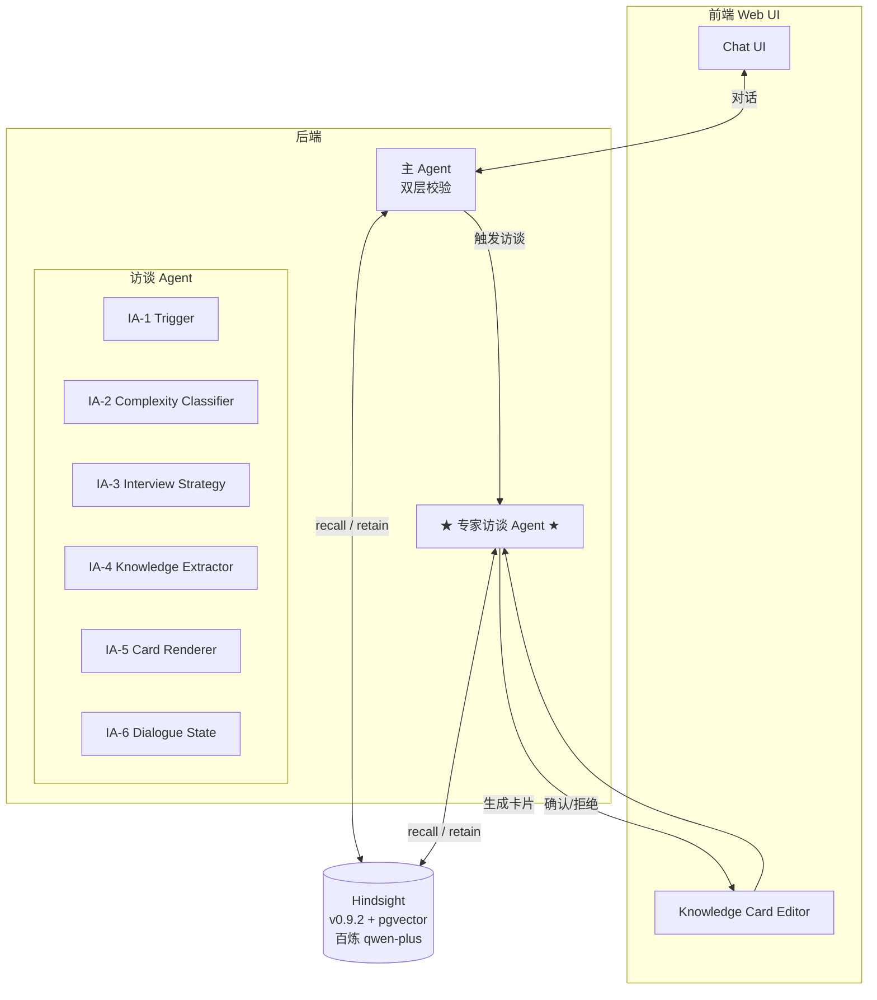

# Hindsight Chatbot — Knowledge Extraction Agent Roadmap

> **创建日期**：2026-08-28
> **状态**：Phase 0 进行中（Hindsight 已部署），Phase 1+ 待启动
> **协作方式**：本文件是项目 source of truth，所有架构 / 模块 / 阶段变更必须先更新本文

---

## 1. 项目概述

### 1.1 定位

独立的 Chatbot 产品，核心能力是**长期记忆 + 主动学习**：

- 用户提问时，Agent 同时用 **LLM 自身知识 + Hindsight 召回**回答（双层校验）
- 当两者都答不上时，自动开启**专家访谈模式**，向用户追问
- 访谈产出的隐性知识被萃取为结构化事实 → 用户审核 → 存入 Hindsight
- 未来类似问题能被 recall 命中，访谈频率随知识库增长而降低

### 1.2 与 vectorize-io/hindsight 的关系

**本项目是 Hindsight 之上的应用层**，不重新发明记忆系统：

- Hindsight（v0.9.2）已部署：pgvector + 百炼 qwen-plus + 本地 BGE/MiniLM
- 我们构建**"提问 / 访谈 / 萃取 / 审核"**的编排层
- Hindsight 提供 retain / recall / reflect / MCP，我们负责 Agent 逻辑、UI、访谈策略

### 1.3 目标用户场景（v1）

| 场景 | 描述 |
|---|---|
| 个人知识管理 | 用户希望 Chatbot 越来越了解他的偏好、项目、决策原因 |
| 团队知识沉淀 | 团队成员轮流被 Chatbot 访谈，沉淀团队共识 |
| 冷启动 | Hindsight 库空时频繁触发访谈；知识库积累后访谈频率自然下降 |

---

## 2. 系统架构

---

## 3. 已确定的关键决策

> 本节防重复讨论——任何想推翻这些决策的讨论必须先更新本文档。

| 维度 | 决策 | 备注 |
|---|---|---|
| Agent 形态 | 独立 Chatbot 产品 | 不嵌到别的产品里，有自己的 UI |
| 知识判定 | **双层校验**：LLM 答 + Hindsight 增补 | 不严格区分"知道/不知道"，Hindsight 始终做 hint |
| 访谈触发条件 | Hindsight recall 空 + LLM 也不确定 | "不确定"的具体定义见 Q1 |
| 访谈深度 | **自适应**：简单事实单轮 / 抽象知识多轮（3-5 轮） | 由 Complexity Classifier 决定 |
| 萃取 + retain | 访谈 Agent 生成**知识卡** → **用户审核** → retain | 用户必须显式确认才落库 |

---

## 4. 核心模块清单

### 4.1 主 Agent 层
| 编号 | 模块 | 职责 |
|---|---|---|
| MA-1 | 主 Agent | 对话入口，LLM 直答 |
| MA-2 | Async Recall | 异步从 Hindsight 拉相关 facts 注入上下文做增补 |
| MA-3 | Routing | 判断是否需要触发访谈 |

### 4.2 专家访谈 Agent 层（核心创新点）
| 编号 | 模块 | 职责 |
|---|---|---|
| IA-1 | Trigger & Routing | 进 / 出访谈模式的判定 |
| IA-2 | Complexity Classifier | 判断问题复杂度（单轮 / 多轮） |
| IA-3 | Interview Strategy | 多轮追问的计划生成（怎么决定下一轮问什么） |
| IA-4 | Knowledge Extractor | Q/A → 结构化事实 |
| IA-5 | Knowledge Card Renderer | 可审核卡片生成 |
| IA-6 | Dialogue State | 多轮对话的 session 管理 |

### 4.3 用户交互层
| 编号 | 模块 | 职责 |
|---|---|---|
| UI-1 | Chat UI | 主对话界面 |
| UI-2 | Knowledge Card Editor | 知识卡编辑 / 审核界面 |
| UI-3 | Bank/Tags Browser | 浏览 Hindsight 里的知识库 |

### 4.4 基础设施
| 编号 | 模块 | 职责 |
|---|---|---|
| INF-1 | Hindsight Client | Hindsight API 的 SDK 封装 |
| INF-2 | LLM Client | 统一 LLM 客户端（百炼 OpenAI 兼容模式） |
| INF-3 | Session Storage | 对话 session 持久化 |
| INF-4 | Audit Log | 用户答过什么 / 存了什么 / 召回时用了什么 |

---

## 5. 开发阶段

### Phase 0：基础设施 & 最小骨架
**目标**：Hindsight 跑起来，最简 Chatbot UI 能对话（不接 Hindsight 逻辑）

涉及模块：
- INF-1 Hindsight Client（封装 retain / recall / reflect）
- INF-2 LLM Client（百炼 qwen-plus）
- UI-1 Chat UI（最简版）

Done 标准：
- [x] Hindsight 在 `localhost:8888` 健康运行（`./docker-compose.yml`）
- [ ] Python 后端能调 Hindsight API
- [ ] Web UI 能发消息，LLM 直接回答，不接 Hindsight

---

### Phase 1：双层校验主 Agent
**目标**：主 Agent 实现"LLM 答 + Hindsight 增补"

涉及模块：
- MA-1 主 Agent
- MA-2 Async Recall

Done 标准：
- [ ] 用户发问 → LLM 答 → 异步 recall 把 Hindsight 相关 facts 显示为"补充信息"
- [ ] recall 空时双层校验依然工作（仅 LLM 答，无增补）
- [ ] recall 命中时能看到具体哪些 fact 被命中（带溯源）
- [ ] **明确"增补"的具体语义**（Q1）

---

### Phase 2：访谈 Agent — 单轮基础版
**目标**：recall 空 + LLM 不确定 → 触发单轮访谈 → retain

涉及模块：
- IA-1 Trigger & Routing
- IA-2 Complexity Classifier（v1：仅判断"是否进访谈"，不区分单/多轮）
- IA-6 Dialogue State（v1：单轮，不需要 state）

Done 标准：
- [ ] recall 空时主 Agent 自动进入访谈模式
- [ ] Agent 反问用户一次
- [ ] 用户回答后直接 retain（v1 不走用户审核）
- [ ] 下次问同一问题，recall 能命中

---

### Phase 3：访谈 Agent — 多轮策略
**目标**：复杂问题触发多轮追问（3-5 轮）

涉及模块：
- IA-2 Complexity Classifier（升级：判断复杂度）
- IA-3 Interview Strategy（**核心**：怎么追问）
- IA-6 Dialogue State（升级：多轮 session）

Done 标准：
- [ ] 抽象问题（"为什么这样设计"）能追问 3-5 轮
- [ ] 追问覆盖：背景 → 判断 → 依据 → 反例
- [ ] 简单事实依然单轮
- [ ] 多轮访谈产出的知识卡质量明显好于单轮（人工评测）

---

### Phase 4：知识萃取自动化
**目标**：访谈 Agent 自动把 Q/A 整理成结构化知识卡

涉及模块：
- IA-4 Knowledge Extractor
- IA-6 Dialogue State（升级：保存访谈历史）

Done 标准：
- [ ] 多轮对话被整理成知识卡，包含实体 / 关系 / 时间 / 上下文 / 边界
- [ ] 知识卡能 retain 到 Hindsight
- [ ] retain 后 Hindsight 的 observation 自动 consolidate 工作正常

---

### Phase 5：用户审核 + retain 闭环
**目标**：知识卡给用户审核、编辑后再 retain

涉及模块：
- IA-5 Knowledge Card Renderer
- UI-2 Knowledge Card Editor

Done 标准：
- [ ] 访谈结束后，UI 弹出知识卡
- [ ] 用户能编辑 / 补充 / 删除
- [ ] 用户点确认才触发 retain
- [ ] 拒绝 / 跳过时访谈结果丢弃

---

### Phase 6：质量打磨 & 评估
**目标**：召回率 / 萃取质量 / 审核通过率达标

涉及模块：
- INF-4 Audit Log
- 评估脚本（独立工具）

Done 标准：
- [ ] 建立 recall 测试集（人工标注问题 + 期望命中）
- [ ] recall 命中率 ≥ 80%
- [ ] 知识卡审核通过率 ≥ 70%（用户不需要大幅修改）
- [ ] 访谈触发频率合理（不会过于频繁）
- [ ] LLM 调用成本可控

---

### Phase 7：生产化
**目标**：监控、备份、权限、限流

涉及模块：
- 监控（基于 Hindsight 自带的 `/metrics` + Prometheus）
- 备份（Hindsight PG 数据）
- 鉴权（API key / OAuth）
- 限流（用户 / IP）
- 部署文档

Done 标准：
- [ ] 关键指标（LLM 调用、token 消耗、recall 命中率）可观测
- [ ] PG 每日自动备份
- [ ] API 鉴权开启
- [ ] 有 README 让别人能 5 分钟复现部署

---

## 6. 待讨论项（Open Questions）

> 启动对应 Phase 前必须先解决对应 Open Question。

| # | 问题 | 触发时机 | 状态 |
|---|---|---|---|
| Q1 | "Hindsight 增补"的具体语义：注入 prompt / 单独展示 / 二者结合？ | Phase 1 设计前 | 待讨论 |
| Q2 | 访谈 Agent 用什么 model？复用主 Agent 还是另起？ | Phase 2 设计前 | 待讨论 |
| Q3 | 知识卡 schema：自定义 / 复用现有标准（Dublin Core 等）？ | Phase 4 设计前 | 待讨论 |
| Q4 | 用户多次访谈同一主题，前后矛盾怎么办？ | Phase 3 实施时 | 待讨论 |
| Q5 | 是否要做"主动学习"（Agent 发现知识缺口主动访谈）？ | Phase 6 后 | 待讨论 |
| Q6 | 多人共用 Hindsight 还是单人？多 bank 怎么组织？ | Phase 7 设计前 | 待讨论 |
| Q7 | Hindsight 的 `disposition traits`（怀疑 / 字面 / 共情）要不要用？ | Phase 1 设计前 | 待讨论 |

---

## 7. 风险与备选方案

| 风险 | 触发场景 | 备选方案 |
|---|---|---|
| LLM 抽取不稳定，结构化字段缺失 | Phase 4 测试时 | few-shot + self-consistency（多次抽取取众数） |
| 用户审核疲劳 | Phase 5 上线后 | 提供"快速批准"按钮 + 默认信任级别（用户可调） |
| Hindsight 召回率不达标 | Phase 6 评估时 | 调整 `HINDSIGHT_API_SEMANTIC_MIN_SIMILARITY` 等参数 / 换 embedding 模型 |
| 访谈 LLM 调用成本高 | Phase 3 多轮后 | 用更便宜的模型做追问，复杂问题再升级 |
| 多用户冲突 | Phase 7 | 用 bank 隔离 + audit log |
| 访谈策略退化为复读机 | Phase 3 | 引入"未来召回率"作为评测指标 |

---

## 8. 参考资源

- [vectorize-io/hindsight](https://github.com/vectorize-io/hindsight) — Hindsight 仓库
- [Hindsight 文档](https://hindsight.vectorize.io) — 官方文档
- [Hindsight 论文](https://arxiv.org/abs/2512.12818) — arXiv
- 本项目核心文件：
  - `./docker-compose.yml` — Hindsight 部署
  - `./ROADMAP.md` — 本文档

---

## 9. 变更日志

| 日期 | 变更 | 原因 |
|---|---|---|
| 2026-08-28 | 初版创建 | 启动讨论 |