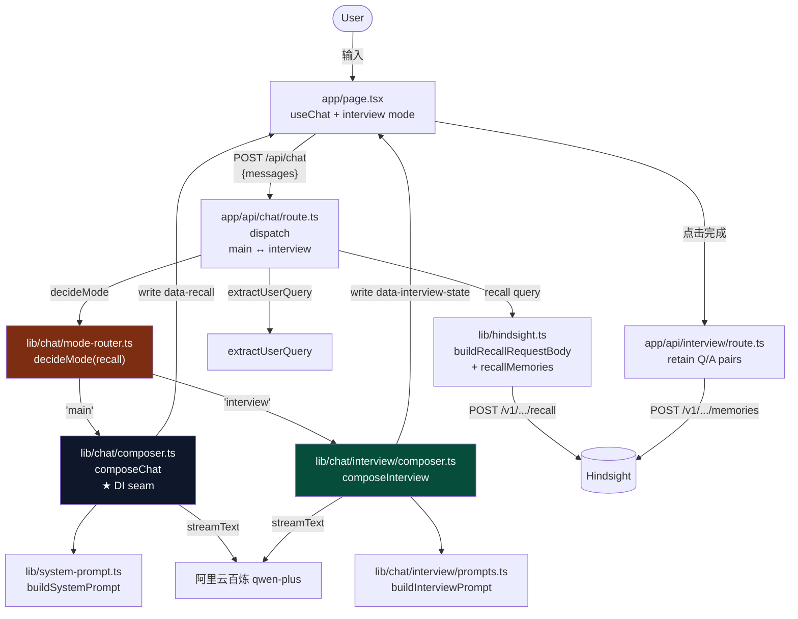

# Hindsight Chatbot — AGENTS.md

> AI agent / 协作者快速上手本项目的入口文档。
> 项目整体规划见 `../ROADMAP.md`，Hindsight 后端见 `../docker-compose.yml`。

## 项目概述

独立的 Chatbot 产品，**复用 [vectorize-io/hindsight](https://github.com/vectorize-io/hindsight) 作为记忆后端**。

**Phase 1 已实现：双层校验（LLM 直答 + Hindsight 增补）**

- 用户问 → 同步 recall → 把 facts 注入 system prompt → LLM 自然融合 → 答案下方挂一个"📚 参考记忆"折叠区（默认收起）

**Phase 2 v1 已实现：专家访谈 Agent（单轮基础版）**

- recall 空 → mode-router 选 `interview` composer → 同步 recall → 反问用户一次 → UI 累积 Q/A pair
- 用户点「完成」 → UI POST `/api/interview` → 后端 retain 到 Hindsight（一次性落库，Phase 5 才加审核）
- 下次问同一问题，recall 能命中 → mode-router 回到 `main` composer

Phase 3+ 会引入多轮访谈、复杂度分类器、持久化 session，见 `../ROADMAP.md`。

---

## 技术栈

| 层 | 选型 | 备注 |
|---|---|---|
| **框架** | Next.js 16.3.3（App Router + Turbopack） | 单体部署，前后端共用一个项目 |
| **语言** | TypeScript 5（strict） | `next.config.ts` 用 `.ts` 后缀 |
| **UI 库** | React 19.2.8 + Tailwind CSS 4 | 不引入 shadcn/ui，原生 Tailwind 够用 |
| **AI SDK** | Vercel AI SDK v5：`ai` + `@ai-sdk/react` + `@ai-sdk/openai` | `streamText` + `useChat` + `createUIMessageStream` |
| **记忆后端** | Hindsight v0.9.2（pgvector + 本地 BGE / MiniLM） | 独立 Docker 容器，通过 REST 调 |
| **LLM** | 阿里云百炼 `qwen-plus`，OpenAI 兼容模式 | `base_url=https://dashscope.aliyuncs.com/compatible-mode/v1` |
| **校验** | zod 4 | API schema 校验 |
| **测试** | Vitest 4 + @vitest/coverage-v8 | 4 个测试文件 / 46 个用例；纯函数 + Composer 注入式单测 |
| **Node** | ≥20 | Next.js 16 要求 |

**未引入**：React Query、SWR、Redux、shadcn/ui、Tailwind UI、Mastra（**Phase 3 才考虑**）。保持轻。

---

## 架构与数据流



**关键设计**：

- **两个 composer，DI seam 复用**：主 agent (`composeChat`) 和 interview agent (`composeInterview`) 共享 `extractUserQuery` + `recallMemories` + `streamText` seam；只有 prompt 和 writeDataPart 不同
- **mode-router 是纯函数**：仅基于 recall 是否空决定，Phase 3+ 加复杂度分类器时再扩
- **`/api/chat` 不 retain**：落库走独立的 `/api/interview`，UI 驱动 session（点「完成」才落）。这样 recall 异步落库期间，agent 仍可在 interview 模式里反问
- **`/api/chat` recall 只调一次**：route 层先 recall 一次，结果既给 router 也给 composer（通过闭包 `recallDep = () => cachedRecall`），避免重复网络 IO
- recall 是**同步**调用，用户期望"问一次答一次"，异步会让 LLM 答跟记忆内容割裂

---

## 目录结构

```
chatbot/
├── app/
│   ├── api/
│   │   ├── chat/
│   │   │   └── route.ts            # Dispatch：recall → mode-router → main / interview composer
│   │   └── interview/
│   │       └── route.ts            # POST items=[Q,A...] → retainMemories
│   ├── layout.tsx                  # 根布局（Geist 字体）
│   ├── page.tsx                    # Chat UI：useChat + 折叠区 + interview mode（完成按钮）
│   └── globals.css                 # Tailwind 入口
├── lib/
│   ├── chat/                       # 编排层（DI seam）
│   │   ├── composer.ts             # 主 agent composer
│   │   ├── extract-user-query.ts   # 纯函数：取最后一条 user message 文本
│   │   ├── mode-router.ts          # decideMode(recall)：main ↔ interview
│   │   └── interview/              # interview agent 子模块
│   │       ├── composer.ts         # interview composer（5 步同主，但 emit data-interview-state）
│   │       └── prompts.ts          # buildInterviewPrompt（反问 prompt）
│   ├── hindsight.ts                # Hindsight REST 客户端 + buildRecallRequestBody 纯函数
│   └── system-prompt.ts            # 主 agent prompt 构建器
├── tests/                          # Vitest 单测（72 个用例）
│   ├── lib/
│   │   ├── chat/
│   │   │   ├── composer.test.ts
│   │   │   ├── extract-user-query.test.ts
│   │   │   ├── mode-router.test.ts
│   │   │   └── interview/
│   │   │       ├── composer.test.ts
│   │   │       └── prompts.test.ts
│   │   ├── system-prompt.test.ts
│   │   └── hindsight-recall-body.test.ts
├── public/                         # 静态资源
├── next.config.ts                  # Next.js 配置
├── tsconfig.json                   # TypeScript 配置
├── vitest.config.mts               # 测试配置
├── package.json                    # 依赖
└── README.md                       # Next.js 自带 README
```

---

## 关键文件职责

| 文件 | 行数 | 职责 |
|---|---|---|
| **`app/page.tsx`** | ~430 | Chat UI。`useChat({transport})` 监听 stream。**Interview mode 状态机**：检测 `data-interview-state` part → 切换 header 文字 + 显示「完成」按钮 → 用户输入时累积 `(question, answer)` pair → 点「完成」POST `/api/interview`。`MessageBubble` 渲染 text + 折叠区 + interview 标识；`RecallSection` 列 facts/entities/scores；`InterviewPairList` 展示本轮累积的 Q/A |
| **`app/api/chat/route.ts`** | ~110 | Dispatch：parse → `extractUserQuery` → `recallMemories`（**只调一次**）→ `decideMode(recall)` → `composeChat` 或 `composeInterview`（共享 cached recall）。两类 composer 的 deps 都在这里装配 |
| **`app/api/interview/route.ts`** | ~80 | POST `{items: [{question, answer}, ...]}` → 翻译成 `RetainItem`（`answer` 作 content，`question` 作 context）→ `retainMemories` → ack。zod 校验输入；非空 items 才落库 |
| **`lib/chat/composer.ts`** | ~110 | `composeChat(messages, deps)` 主 agent 编排：extract → recall → build prompt → stream LLM → write `data-recall` part + merge |
| **`lib/chat/interview/composer.ts`** | ~110 | `composeInterview(messages, deps)` interview agent 编排：5 步结构同主，但 write `data-interview-state`（`{awaitingAnswer, query, askedAt}`）。Phase 3+ 会扩 session state |
| **`lib/chat/interview/prompts.ts`** | ~65 | `buildInterviewPrompt({query, recall})` 纯函数。让 LLM 反问一次（不再回答）。覆盖事实/因果/偏好三类 query 的反问策略 |
| **`lib/chat/mode-router.ts`** | ~26 | `decideMode(recall)` 纯函数：recall 空 → `interview`，否则 `main`。Phase 3+ 会加复杂度分类 |
| **`lib/chat/extract-user-query.ts`** | ~32 | `extractUserQuery(messages)` 纯函数。封装 `UIMessage.parts` 类型 hack（AI SDK v5 公开类型不暴露 parts，运行时稳定） |
| **`lib/hindsight.ts`** | ~220 | Hindsight REST 客户端。导出：`recallMemories(query, options?)`、`retainMemories(items)`（**Phase 2 v1 才真正被调**）、`isHindsightHealthy()`，以及纯函数 `buildRecallRequestBody(query, options)` |
| **`lib/system-prompt.ts`** | ~50 | 主 agent 双层校验 prompt 构建器 |

---

## 环境变量

```bash
HINDSIGHT_API_URL=http://localhost:8888      # Hindsight REST endpoint（后端用）
HINDSIGHT_BANK_ID=zhangwei                   # Phase 1 demo bank
BAILIAN_API_KEY=sk-xxx                      # 阿里云百炼 API key（必填，通过 shell env 注入）
LLM_BASE_URL=https://dashscope.aliyuncs.com/compatible-mode/v1
LLM_MODEL=qwen-plus
```

**安全约定**：

- `BAILIAN_API_KEY` **永远不写进任何文件**（即使 `.env.local` 在 .gitignore 里）。通过 shell env 注入：`BAILIAN_API_KEY=$BAILIAN_API_KEY npm run dev`，项目根的 `Makefile` 的 `dev` target 已处理
- `.env.local` 已被 .gitignore（Next.js 默认）

---

## 常用命令

```bash
# 在项目根（推荐）
make restart   # ← 重启 dev server
make status    # 检查 chatbot + Hindsight 健康
make logs      # tail dev server 日志
make clean     # 停 + 清 .next 缓存

# 在 chatbot/ 下直接跑
cd chatbot
BAILIAN_API_KEY=$BAILIAN_API_KEY npm run dev    # 启动
BAILIAN_API_KEY=$BAILIAN_API_KEY npm run build  # 生产构建

# 测试 / 类型检查
npm test              # 跑全部 vitest 用例（72 个）
npm run test:watch          # watch 模式
npm run test:coverage       # 覆盖率（v8）
npm run type-check # tsc --noEmit
npm run lint        # eslint
```

---

## 已知坑（重要！）

### 1. `include.entities` 必须是对象，不是 boolean

```typescript
// ❌ 错（触发 422）
include: { entities: true }
// ✅ 对
include: { entities: { max_tokens: 500 } }
```

错误信息：`Input should be a valid dictionary or object to extract fields from`

### 2. `convertToModelMessages` 是 async

AI SDK v5 里它是 Promise，必须 `await`：

```typescript
messages: await convertToModelMessages(messages),
```

### 3. `UIMessage.parts` 类型 hack 已封装在 `extract-user-query.ts`

AI SDK v5 的 `UIMessage` 公开类型不暴露 `parts`，但运行时稳定。`lib/chat/extract-user-query.ts` 集中处理这个 cast（带 SAFETY 注释）。**新代码不要再在 route handler 或 UI 组件里直接 cast `parts`**——需要时把逻辑加到 `extractUserQuery()`，保持类型 hack 集中在一处。

### 4. Hindsight `HINDSIGHT_API_WORKER_ID` 必须固定

dev 模式可以省略（每次重启都新 ID），但生产部署前必须设置稳定值，否则重启后未完成的任务变孤儿。

### 5. `HINDSIGHT_API_URL` 在 Next.js 服务端用

浏览器**不知道** Hindsight 在哪。所有 recall/retain 都从 Next.js route handler 发起 server-to-server 调用。

### 6. `min_scores.reranker=0.3` 默认过滤低相关 facts

`lib/hindsight.ts` 默认在请求里加 `min_scores: { reranker: 0.3 }`，把 cross-encoder 认为不相关的事实过滤掉。

**设计意图**：Hindsight 在 budget 模式下会把召回结果 padding 到预算上限（即使没有真正相关的事实）。如果不加这个 floor，无关 query（比如"什么是黑洞？"）会返回 3 条关于张伟的事实、LLM 被 noise 干扰、UI折叠区也会展示无关内容。

**取舍**：阈值 0.3 是经验值。**代价**：中等相关但分数略低（<0.3）的事实会被过滤掉，需要根据实际效果调。**禁用**：传 `{ minScores: {} }` 给 `recallMemories()` 即可关闭。

**后端联动**：`docker-compose.yml` 里 Hindsight 用了 `HINDSIGHT_API_RERANKER_PROVIDER=alibaba` + `qwen3-rerank`。默认 `local` 是 `cross-encoder/ms-marco-MiniLM-L-6-v2`（英文 MS MARCO 训练），对中文返回随机高分（黑洞 query 召回张伟 facts rerank=0.99 是 bug），换 `qwen3-rerank` 才正常。

---

## 调试技巧

```bash
# 1. 直接 curl /api/chat 看 stream 协议
curl -N -X POST http://localhost:3000/api/chat \
  -H "Content-Type: application/json" \
  -d '{"messages":[{"role":"user","parts":[{"type":"text","text":"张伟在哪里工作？"}]}]}' \
  | head -c 4000

# 2. Hindsight 健康检查
curl http://localhost:8888/health | python3 -m json.tool

# 3. 列出 bank 的事实数
curl http://localhost:8888/v1/default/banks/zhangwei/stats | python3 -m json.tool

# 4. 直接调 Hindsight recall（绕过 chatbot）
curl -X POST http://localhost:8888/v1/default/banks/zhangwei/memories/recall \
  -H "Content-Type: application/json" \
  -d '{"query":"张伟在哪里工作？","types":["observation","world"],"prefer_observations":true}'
```

---

## 设计约束 / 不要做的事

- ❌ **不要在 `.env.local` 写 `BAILIAN_API_KEY`**——通过 shell env 注入
- ❌ **不要重新发明 memory**——所有记忆走 Hindsight
- ❌ **不要把 recall 改成异步**——用户体验依赖同步 recall
- ❌ **不要绕过 `/api/chat` 直接在客户端 retain**——落库只能走 `/api/interview`
- ❌ **不要让主 composer 和 interview composer 互相 import**——它们是 seam 的两端，共享纯函数（`extractUserQuery`、`recallMemories`），不共享 compos
- ❌ **不要在 Phase 2 v1 引入 Mastra / LangGraph**——Phase 3+ 才考虑
- ❌ **不要直接修改 `app/page.tsx` 用 shadcn/ui / Tailwind UI**——保持原生 Tailwind
- ❌ **不要硬编码 LLM 模型名**——统一从 `process.env.LLM_MODEL` 读

---

## Phase 1 Done 标准

- [x] 用户发问 → recall → LLM 用注入的 recall 答 → 主答案下方展示"参考记忆"折叠区
- [x] recall 空时双层校验依然工作（仅 LLM 答，无折叠区）
- [x] recall 命中时折叠区显示具体 facts + entities + scores
- [x] observation 与 raw fact 不重复（`prefer_observations=true` 生效）
- [x] 中文 recall 验证通过
- [x] 同一问题连续问 5 次，recall 召回稳定

---

## Phase 2 v1 Done 标准

- [x] recall 空时主 Agent 自动进入访谈模式（mode-router + interview composer）
- [x] interview 反问单轮，且 emit `data-interview-state` 让 UI 识别
- [x] UI 累积 `(question, answer)` pair，用户点「完成」POST `/api/interview`
- [x] `/api/interview` 通过 zod 校验，翻译 `RetainItem` 后 retain 到 Hindsight
- [x] 下次问同一问题（retain 后等几秒让 Hindsight 抽取完成），recall 能命中 → 回 main flow
- [x] interview 模式连续多轮（每轮反问一次），pair 累积正确

---

## 相关文件

- `../ROADMAP.md` — 项目整体 roadmap（Phase 0-7）
- `../docker-compose.yml` — Hindsight 后端部署
- `../Makefile` — 服务管理命令（restart / status / logs / clean）
- [vectorize-io/hindsight](https://github.com/vectorize-io/hindsight) — Hindsight 后端仓库
