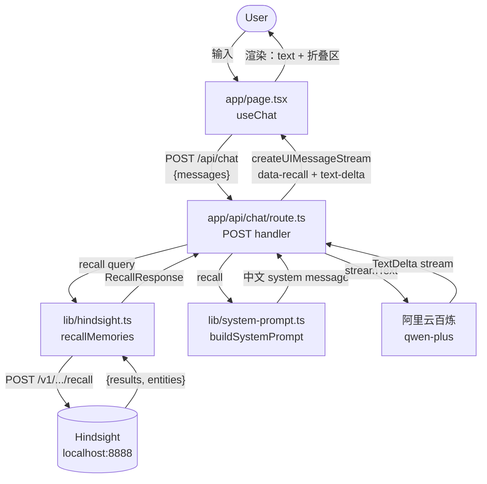

# Hindsight Chatbot — AGENTS.md

> AI agent / 协作者快速上手本项目的入口文档。
> 项目整体规划见 `../ROADMAP.md`，Hindsight 后端见 `../docker-compose.yml`。

## 项目概述

独立的 Chatbot 产品，**复用 [vectorize-io/hindsight](https://github.com/vectorize-io/hindsight) 作为记忆后端**。

**Phase 1 已实现：双层校验（LLM 直答 + Hindsight 增补）**

- 用户问 → 同步 recall → 把 facts 注入 system prompt → LLM 自然融合 → 答案下方挂一个"📚 参考记忆"折叠区（默认收起）

Phase 2+ 会引入**专家访谈 Agent**（recall 空 + LLM 不确定时触发反问，把隐性知识萃取进 Hindsight），见 `../ROADMAP.md`。

---

## 技术栈

| 层 | 选型 | 备注 |
|---|---|---|
| **框架** | Next.js 16.3.3（App Router + Turbopack） | 单体部署，前后端共用一个项目 |
| **语言** | TypeScript 5（strict） | `next.config.ts` 用 `.ts` 后缀 |
| **UI 库** | React 19.2.8 + Tailwind CSS 4 | 不引入 shadcn/ui，原生 Tailwind 够用 |
| **AI SDK** | Vercel AI SDK v5：`ai` + `@ai-sdk/react` + `@ai-sdk/openai` | `streamText` + `useChat` + `createUIMessageStream` |
| **记忆后端** | Hindsight v0.9.2（pgvector + 本地 BGE / MiniLM） | 独立 Docker 容器，通过 REST 调 |
| **LLM** | 阿里云百炼 `qwen-plus`，OpenAI 兼容模式 | `base_url=https://dashscope.aliyuncs.com/compatible-mode/v1` |
| **校验** | zod 4 | API schema 校验 |
| **Node** | ≥20 | Next.js 16 要求 |

**未引入**：React Query、SWR、Redux、shadcn/ui、Tailwind UI、Mastra（**Phase 3 才考虑**）。保持轻。

---

## 架构与数据流



**关键设计**：recall 是**同步**调用（在 `route.ts` handler 里 await），用户期望"问一次答一次"，异步会让 LLM 答跟记忆内容割裂。

---

## 目录结构

```
chatbot/
├── app/
│   ├── api/
│   │   └── chat/
│   │       └── route.ts          # POST handler：recall + streamText
│   ├── layout.tsx                  # 根布局（Geist 字体）
│   ├── page.tsx                    # Chat UI（useChat + 折叠区）
│   └── globals.css                 # Tailwind 入口
├── lib/
│   ├── hindsight.ts                # Hindsight REST 客户端
│   └── system-prompt.ts            # 双层校验 prompt 构建器
├── public/                         # 静态资源（Next.js boilerplate）
├── .env.example                    # 环境变量模板（提交）
├── .env.local                      # 本地配置（不提交）
├── next.config.ts                  # Next.js 配置
├── tsconfig.json                   # TypeScript 配置
├── package.json                    # 依赖
└── README.md                       # Next.js 自带 README（占位）
```

**遵循 Next.js App Router 约定**（不强行把代码挪进 `src/`——框架默认就是 `app/`+`lib/` 在根）。

---

## 关键文件职责

| 文件 | 行数大概 | 职责 |
|---|---|---|
| **`app/page.tsx`** | ~180 | Chat UI。`useChat({transport})` 监听 stream。`MessageBubble` 组件提取 `text` + `data-recall` parts。`RecallSection` 组件渲染折叠区（默认收起，列出 facts / entities / scores） |
| **`app/api/chat/route.ts`** | ~110 | POST handler。流程：(1) 抽取最后一条 user message 文本；(2) 同步 `recallMemories`；(3) `buildSystemPrompt`；(4) `streamText` 调百炼；(5) `createUIMessageStream` 包装 stream，把 recall metadata 作为 `data-recall` part 一起流出去 |
| **`lib/hindsight.ts`** | ~155 | Hindsight REST 客户端。导出：`recallMemories(query, options?)`、`retainMemories(items)`、`isHindsightHealthy()`。`request<T>()` 私有 helper 统一错误处理（`HindsightError`） |
| **`lib/system-prompt.ts`** | ~50 | 双层校验 prompt 构建器。`buildSystemPrompt(recall)` 返回完整中文 system message：persona + 长期记忆 section + 引用规则（不编造、优先最新事实） |

---

## 环境变量

```bash
HINDSIGHT_API_URL=http://localhost:8888      # Hindsight REST endpoint（后端用）
HINDSIGHT_BANK_ID=zhangwei                   # Phase 1 demo bank
BAILIAN_API_KEY=sk-xxx                      # 阿里云百炼 API key（必填，通过 shell env 注入）
LLM_BASE_URL=https://dashscope.aliyuncs.com/compatible-mode/v1
LLM_MODEL=qwen-plus
```

**安全约定**：
- `BAILIAN_API_KEY` **永远不写进任何文件**（即使 `.env.local` 在 .gitignore 里）。通过 shell env 注入：`BAILIAN_API_KEY=$BAILIAN_API_KEY npm run dev`，项目根的 `Makefile` 的 `dev` target 已处理
- `.env.local` 已被 .gitignore（Next.js 默认）

---

## 常用命令

```bash
# 在项目根（推荐）
make restart   # ← 重启 dev server
make status    # 检查 chatbot + Hindsight 健康
make logs      # tail dev server 日志
make clean     # 停 + 清 .next 缓存

# 在 chatbot/ 下直接跑
cd chatbot
BAILIAN_API_KEY=$BAILIAN_API_KEY npm run dev    # 启动
BAILIAN_API_KEY=$BAILIAN_API_KEY npm run build  # 生产构建
```

---

## 已知坑（重要！）

### 1. `include.entities` 必须是对象，不是 boolean

```typescript
// ❌ 错（触发 422）
include: { entities: true }
// ✅ 对
include: { entities: { max_tokens: 500 } }
```

错误信息：`Input should be a valid dictionary or object to extract fields from`

### 2. `convertToModelMessages` 是 async

AI SDK v5 里它是 Promise，必须 `await`：

```typescript
messages: await convertToModelMessages(messages),
```

### 3. `UIMessage` 在 v5 里没有 `parts` 公开类型

读 `message.parts` 时需要 `as unknown as { parts?: ... }` 加 SAFETY 注释。`UIMessage.parts` 实际存在但类型系统不暴露。

### 4. Hindsight `HINDSIGHT_API_WORKER_ID` 必须固定

dev 模式可以省略（每次重启都新 ID），但生产部署前必须设置稳定值，否则重启后未完成的任务变孤儿。

### 5. `HINDSIGHT_API_URL` 在 Next.js 服务端用

浏览器**不知道** Hindsight 在哪。所有 recall/retain 都从 Next.js route handler 发起 server-to-server 调用。

---

## 调试技巧

```bash
# 1. 直接 curl /api/chat 看 stream 协议
curl -N -X POST http://localhost:3000/api/chat \
  -H "Content-Type: application/json" \
  -d '{"messages":[{"role":"user","parts":[{"type":"text","text":"张伟在哪里工作？"}]}]}' \
  | head -c 4000

# 2. Hindsight 健康检查
curl http://localhost:8888/health | python3 -m json.tool

# 3. 列出 bank 的事实数
curl http://localhost:8888/v1/default/banks/zhangwei/stats | python3 -m json.tool

# 4. 直接调 Hindsight recall（绕过 chatbot）
curl -X POST http://localhost:8888/v1/default/banks/zhangwei/memories/recall \
  -H "Content-Type: application/json" \
  -d '{"query":"张伟在哪里工作？","types":["observation","world"],"prefer_observations":true}'
```

---

## 设计约束 / 不要做的事

- ❌ **不要在 `.env.local` 写 `BAILIAN_API_KEY`**——通过 shell env 注入
- ❌ **不要重新发明 memory**——所有记忆走 Hindsight
- ❌ **不要把 recall 改成异步**——用户体验依赖同步 recall
- ❌ **不要在 Phase 1 引入 Mastra / LangGraph**——Phase 3+ 才考虑
- ❌ **不要直接修改 `app/page.tsx` 用 shadcn/ui / Tailwind UI**——保持原生 Tailwind
- ❌ **不要硬编码 LLM 模型名**——统一从 `process.env.LLM_MODEL` 读

---

## Phase 1 Done 标准

- [x] 用户发问 → recall → LLM 用注入的 recall 答 → 主答案下方展示"参考记忆"折叠区
- [x] recall 空时双层校验依然工作（仅 LLM 答，无折叠区）
- [x] recall 命中时折叠区显示具体 facts + entities + scores
- [x] observation 与 raw fact 不重复（`prefer_observations=true` 生效）
- [x] 中文 recall 验证通过
- [x] 同一问题连续问 5 次，recall 召回稳定

---

## 相关文件

- `../ROADMAP.md` — 项目整体 roadmap（Phase 0-7）
- `../docker-compose.yml` — Hindsight 后端部署
- `../Makefile` — 服务管理命令（restart / status / logs / clean）
- [vectorize-io/hindsight](https://github.com/vectorize-io/hindsight) — Hindsight 后端仓库